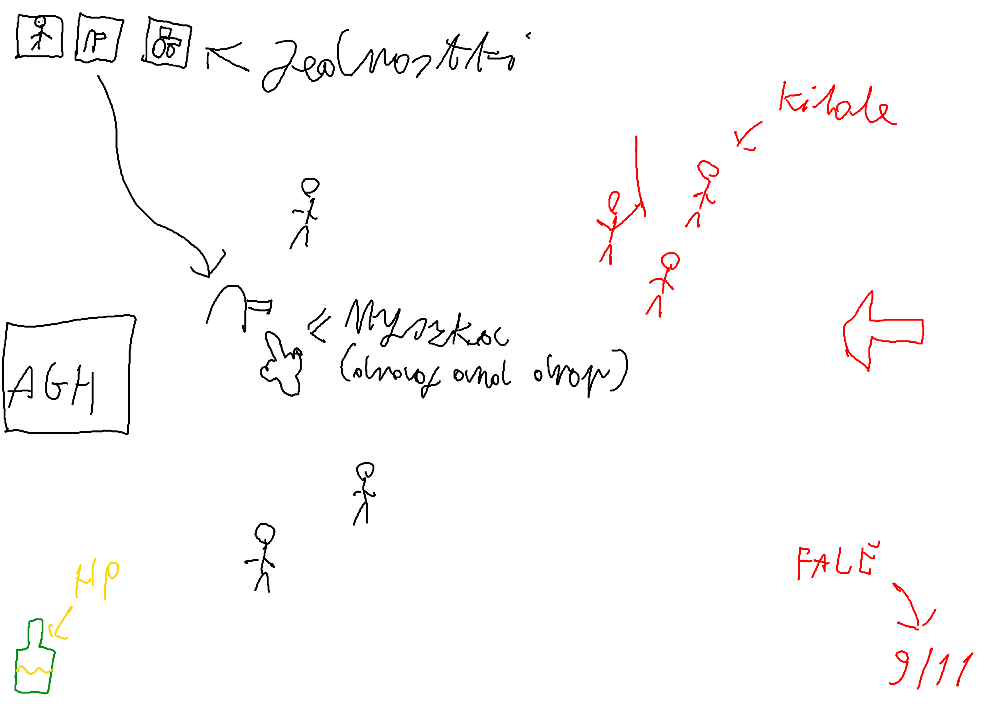

# Student-fightin' (no bo ballin już nie pasuje)
Pomysł gry, to taki rts/tower defence gdzie przeciągamy na plansze studentów i bronią agh przed kibolami klubu rks chuwdu :)
  
## Ogólny plan realizacji
Najpierw skupiamy się na stworzeniu mvp (minimal viable product), czyli prosty prototyp żeby to wgl działało. Potem jak nam zostanie czasu można te mechaniki rozwniąć, ale lepiej planować że nam tego czasu nie zostanie.
ciężko też tak na sucho grę wymyśleć, dużo się pewnie zmieni jak chodzi o gameplay w trakcie testów
Paczki typu sdl2, openGl proszę importować przez FetchContent i vcpkg (jako fallback), żeby to działało cross platform.
nie wrzucajcie całych bibliotek do repozytorium

## Tech stack
OpenGL + SDL2 + CMake + C++

## Design doc 
### mechaniki (do mvp)
- Zadaniem gracza jest obrona budynku agh przed kibolami, gracz widzi całą planszę z lotu ptaka
- Gracz przeciąga na plansze postacie/obiekty, może je wrzucić w dowolny obszar po prawej połowie ekranu (bo na całej mapce zbyt op imo)
- Do dyspozycji mamy 3 (lub więcej ale to trzeba wymyśleć) typy jednostek. każda jednostka powinna być unikatowa a nie po prostu reskin z lepszymi statami
  - student - podchodzi do kibola i się z nim bije (jak w tej gierce rycerze https://youtu.be/EvEGuTAsYp4?si=GamT-wYS7684qhyB&t=8)
  - Koparka - wrzucamy na plansze i po prostu jedzie przed siebie, taranuje wszystkich na drodze
  - działko - jeżeli w pobliżu znajduje się kibol, to do niego strzela
- Ai kiboli działa tak, idą w lewo, dookoła każdego z nich jest niewidzalne kółko, jak w tym kółku wykryją jakąś postać od gracza to podchodzą i się z nim biją, jak nie to biegną w stronę agh
- Budynek agh ma swoje hp, kibole go stopniowo ubijają, jak spadnie do zera to przegrywamy
- Gra spawnuje kiboli losowo, musimy przeżyć np 5 minut (jeżeli będzie czas, zrobiłbym to na fale, tak jak w małpkach gdzie każda fala ma określonych przeciwników i ich układ a nie losowo)
### mechanik (dodatkowe)
- Rozgrywka na fale
  - pomiędzy falami można kupić/ulepszyć jednostki
  - każda fala ma inny układ przeciwników
- Różne typy przeciwników
  - ze sprzętem, bije naszych bronią białą
  - z klamką, strzela do naszych w pobliżu
  - można porobić reskiny że np więcej hp, więcej speedu itd
- Ustawienia
- Sklepik studenciak gdzie można kupować/wybrać jedno za free ulepszenia/e do jednostek pomiędzy falami
- intro i menusy
### artstyle
Artstyle będzie wyglądał tak jakby gierka była narysowana odręcznie, na kartce w zeszycie.

## Lista tasków 

### MVP:
- [x] Ogarnięcie SDL2 i konfiguracja builda przez FetchContent / vcpkg
- [ ] Rendering pipeline (SDL2 + OpenGL): prosty sprite renderer, kamera pokazująca całą planszę
- [ ] Input & UI: przeciąganie i upuszczanie jednostek ograniczone do prawej połowy ekranu
- [ ] Podstawowe jednostki: Student (melee), Koparka (ram/vehicle), Działko (ranged)
- [ ] Prosta AI przeciwników: idą w lewo, wykrywają jednostki gracza i wchodzą w walkę
- [ ] Spawner: generowanie przeciwników w czasie z prostym harmonogramem trudności
- [ ] Budynek agh z HP, obsługa obrażeń i warunek przegranej
- [ ] Podstawowe kolizje i interakcje: uderzenia jednostek, pociski, podstawowe reakcje

### Jeżeli zostanie czasu:
- [ ] System fal z predefiniowanymi wave'ami i pacingiem
- [ ] Sklep/ulepszenia między falami (np. jedna darmowa opcja)
- [ ] Dodatkowe typy przeciwników (ze sprzętem, strzelający, szybcy)
- [ ] Przeszkody i elementy mapy (kolce, ściany)
- [ ] Audio: efekty dźwiękowe i muzyka w tle
- [ ] Menu główne, ekran pauzy i podstawowy polish

